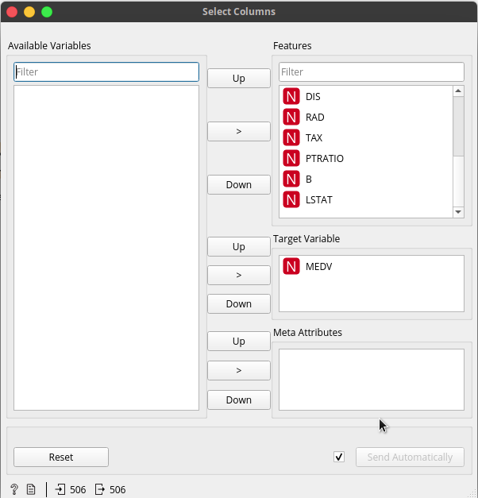
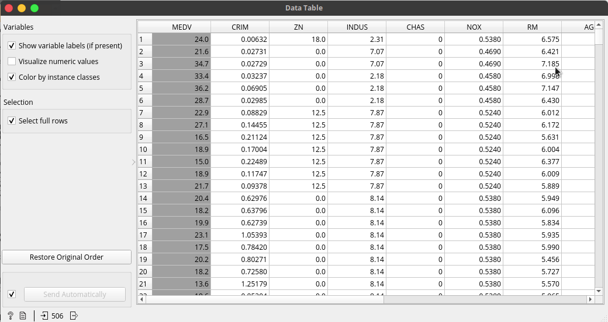
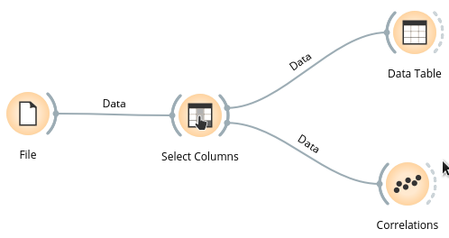
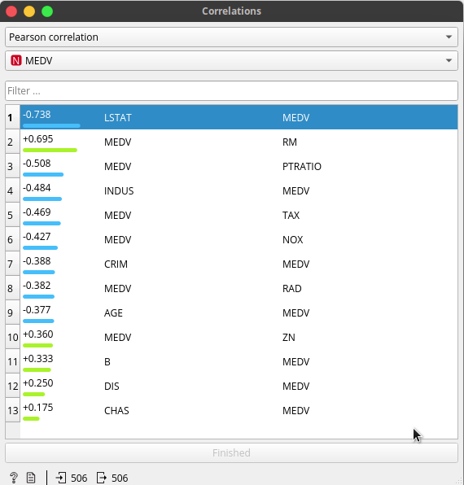
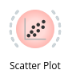
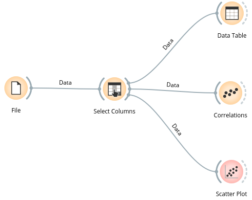

# Orange-Tutorial
Tutorial using [Orange Visual Programing](https://orange.biolab.si/) API.

## Download Orange

[Click here](https://orange.biolab.si/download/#macos) for download the Orange last version:

+ Choose your operative system
+ Execute the download file

## Create a virtual environment an launch Orange

1. Go to the path that do you want to create a virtual environment, and in the command line type this:

```bash
virtualenv --python=python3 --system-site-packages orange3venv
```
Great! You've your virtual environment **named orange3env**.

2. Activate the virtual environment, typing in the command line:

```bash
source orange3venv/bin/activate
```

3. Install Orange and the other necessary packages in your virtual environment:
```bash
# Install Qt dependencies for the GUI
pip install PyQt5 PyQtWebEngine

# Install Orange
pip install orange3
```
4. Finally, launch orange GUI:

```bash
python3 -m Orange.canvas
```
## Let's to explore Orange

+ Open Orange software
+ Click en new

### Load your first dataset

Now, you're in a blank canvas. In the left panel, you can see the widgets that you have installed in Orange. Search the Data widget, and choose the icon *File*, the icon will be added to the canvas.


Double click in the icon File, and choose one some the pre-installed datasets.


### A little explorer

#### Select or sort the dataset columns

From widget *Data* add *Select Columns*:


Double click in the icon and choose and order the columns that you're interested in *Features*, *Target* or *Meta Attributes*.



And with the widget *Data Table* we can visualize our dataset. There, the variables are ordered as *Target* (in dark grey) and *Feature* variables.



#### Find the correlation between the variables.

Choose the widget *Correlation* and connect it with the output of *Select Columns*.



How our target variable is *MEDV*, we're interested in seeing how the other variables are correlated with it.



We can see the values are sorter, with a stronger correlation at the list top, and in the bottom the weaker. This feature is validated with a scatter plot. Here, we'll introduce a new widget, *Visualize*. Choose the option *Correlation*.



Bellow, we see the workflow until now.


