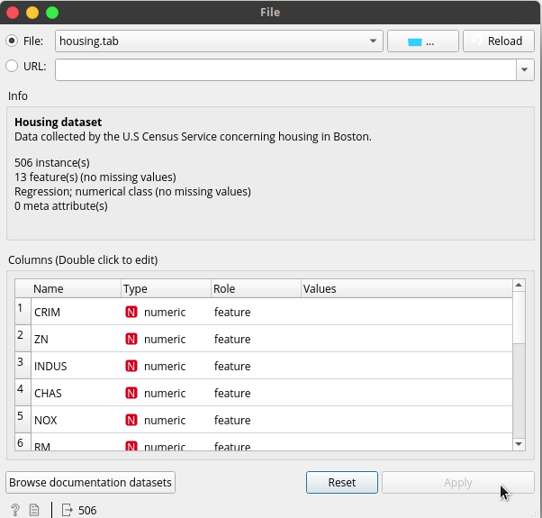

# Orange-Tutorial
Tutorial using [Orange Visual Programing](https://orange.biolab.si/) API.

## Download Orange

[Click here](https://orange.biolab.si/download/#macos) for download the Orange last version:

+ Choose your operative system
+ Execute the download file

## Let's to explore Orange

+ Open Orange software
+ Click en new

### Load your first dataset

Now, you're in a blank canvas. In the left panel, you can see the widgets that you have installed in Orange. Search the Data widget, and choose the icon *File*, the icon will be added to the canvas.

Double click in the icon File, and choose one some the pre-installed datasets.

